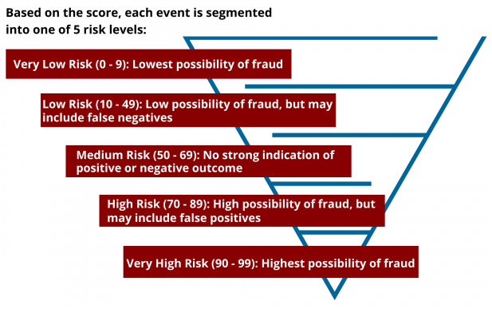
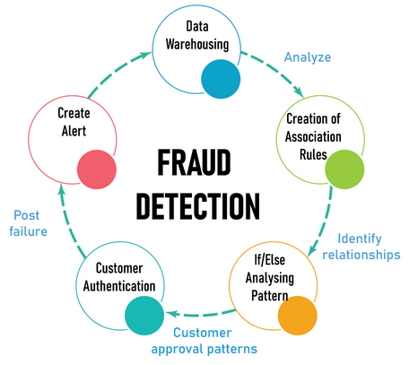

## 1 Information systems

TODO:

## 2 Database systems

### Designing the Database for an Electronics E-Shop

Designing an efficient and scalable database is crucial for the successful operation of an online electronics store. The system must handle product catalog management, customer profiles, order processing, inventory tracking, and reporting, among other functions. 

### 1. **What our e-shop needs to store in the database**

The database for the e-shop will store the following data:

- **Product Data**: Each product entry will include information such as product name, description, category, brand, model, price, stock levels, and technical specifications. This is essential for catalog management, inventory tracking, and search functionality.
- **Customer Profiles**: These will store customer details like name, email address, password (securely hashed), addresses, order history, and preferences. This data enables personalized experiences and order processing.
- **Order Details**: Information about each customer’s order, including products purchased, quantities, order status, payment details, and shipping information, will be stored to manage transactions efficiently.
- Other entities like product reviews, warranty claims, custom lists of favourite products or repeatedly bought products are also good to include.

These three main categories form the backbone of the e-shop’s database, ensuring all necessary data is available for processing transactions, managing inventory, and delivering a personalized user experience, leading to increased profitability.

### 2. **Benefits of Using a Database**

Using a database management system (DBMS) for the e-shop offers several advantages over file-based storage:

- ### **Benefits of Using a Database**

  Using a database management system (DBMS) for an e-shop offers several key advantages:

  - **Enhanced Security**: Built-in features like encryption and role-based access controls reduce the risk of data breaches.
  - **Easier Querying**: SQL allows quick and efficient data retrieval, making it easy to generate reports and search for products or customer orders.
  - **Data Consistency**: Updates, such as stock changes after a purchase, are reflected immediately, ensuring no issues like overselling.
  - **Data Integrity**: Features like constraints and transactions ensure accurate data, with all processes (e.g., payment, stock reduction) completed atomically.
  - **Concurrency**: Databases handle multiple users simultaneously without conflicts, ensuring real-time updates during high-traffic events like sales.

### 3. **Database design and structure**

To efficiently manage the e-shop’s data, the database will be structured around key entities, with relationships defined between them. The core entities are:

- **Product**: Attributes include product name, description, category, brand, price, stock levels, and features. It ensures that all product details are easily accessible for catalog management and inventory tracking.
- **Customer**: Attributes include customer ID, name, email, password, shipping address, and order history. These details support personalization, secure user authentication, and order processing.
- **Order**: Attributes include order ID, customer ID (linking to the customer table), order date, total amount, payment status, and shipment details. This entity tracks purchases and links each order to the relevant customer and product(s).

These entities will be linked using **foreign key relationships** to maintain data integrity, ensuring that each order, customer, and product is correctly associated with relevant records across the database. For example, each **Order** will reference both the **Customer** who placed it and the **Products** it includes.

To design the e-shop’s database, we start with two key models: the **logical model** and the **physical model**.

- **Logical Model**: The logical model focuses on the entities and their attributes without considering implementation details like primary keys, foreign keys, or cardinality. The relationships among the entities in the logical model are as follows:

  ```mermaid
  %%{init: {"flowchart": {"htmlLabels": false}} }%%
  flowchart LR
      
      PRODUCT("`**Product**
      name
      description
      brand
      price
      features
  	`")
  	
      CUSTOMER("`**Customer**
      name
      email
      password
      shipping
      `")
      
      ORDER("`**Order**
      order date
      total amount
      payment status
      shipment details
      `")
      
       ORDER -- placed by --- CUSTOMER
      ORDER -- contains --- PRODUCT 
  ```

- **Physical Model**: The physical model converts the logical model into a detailed structure, including tables, keys, cardinality, and constraints, preparing the database for implementation.

  - **Entity-Relationship Diagram (ERD)**: Visualizes entities, attributes, and relationships, such as a one-to-many relationship between **Customer** and **Order**.
  - **Normalization**: Organizes data efficiently by removing redundancy and structuring it into related tables (e.g., separating **Customer** and **Order**).
  - **Table Structure**: Each entity becomes a table, with its attributes as columns (e.g., **Product** becomes a table with name, price, and stock).
  - **Indexes**: Speed up data retrieval by indexing frequently queried columns like product names and customer emails.
  - **Storage Optimization**: Considers data types, table partitioning, and storage efficiency to handle the database's growth.

  ```mermaid
  erDiagram
      PRODUCT {
          int product_id PK
          string name
          string description
          string category
          string brand
          decimal price
          int stock_levels
          string features
      }
      
      CUSTOMER {
          int customer_id PK
          string name
          string email
          string password
          string shipping_address
      }
      
      ORDER {
          int order_id PK
          int customer_id FK
          date order_date
          decimal total_amount
          string payment_status
          string shipment_details
      }
      
      CATEGORY {
          int category_id PK
          string category_name
      }
      
      PAYMENT {
          int payment_id PK
          int order_id FK
          string payment_method
          string payment_status
          string payment_gateway
      }
      
      SHIPPING {
          int shipping_id PK
          int order_id FK
          string shipping_provider
          string tracking_number
          date estimated_delivery
      }
      
      PRODUCT ||--o{ CATEGORY : "belongs to"
      ORDER ||--o{ CUSTOMER : "placed by"
      ORDER ||--o{ PRODUCT : "contains"
      PAYMENT ||--o{ ORDER : "related to"
      SHIPPING ||--o{ ORDER : "shipped by"
  
  ```

  

## Algorithms and Programming

TODO:

## 4 **Artificial Intelligence**

The e-shop will integrate AI in three primary areas: **personalized product recommendations**, **automated customer service (chatbots)**, and **fraud detection**.

- **Personalized Product Recommendations**: AI will analyze customer behavior (e.g., browsing patterns and purchase history) to dynamically suggest products tailored to each user’s preferences. This will increase customer satisfaction and boost conversion rates.

- **Automated Customer Service (Chatbots)**: A conversational AI chatbot will respond to customer inquiries, such as order status and shipping details, improving response times and customer satisfaction. The chatbot will use Natural Language Processing (NLP) to understand and assist customers more efficiently.

- [**Fraud Detection**](https://www.youtube.com/watch?v=QFyM3w95fXI): AI will monitor transaction patterns to detect anomalies, such as multiple purchases from different locations or unusual payment methods. The system will continually learn from new data, improving its ability to flag potential fraud.

  - **Behavioral analytics** is implemented using machine learning to distinguish **abnormal** from **normal** user behavior.
  
    1. Customers are segmented into groups, each with different behavioral attributes like time of purchases, cost of orders, number of orders, etc.
    2. The system identifies whether the user's behavior fits into one of these behavioral groups.
    3. The system calculates a **Fraud Score**, which represents the probability of fraud as a percentage.

       
    4. When the **Fraud Score is low**, the purchase is **approved**. Otherwise, the purchase is flagged as suspicious and must be verified by the customer or store.
  
  - **Fraud detection flow**:
  
    1. **Data warehousing**: Gather transaction data (like amounts, locations, and time).
    2. **Creation of association rules**: Understand what normal activity looks like.
    3. **If/Else analysing pattern**: Find transactions that don’t match usual patterns.
       - **Risk scoring**: Assign a score to flag risky transactions.
    4. **Customer authentication**: Investigate flagged transactions and stop fraud if confirmed.
    5. **Create alerts**: Create alerts for suspicious activities.
    6. **Learn and Improve (Data Warehousing)**: Use feedback to improve future fraud detection.
  
    
  

### **AI Learning Applications**

To ensure continuous improvement, AI will use several machine learning techniques:

- **Supervised Learning** for Product Recommendations: The system will learn from past customer interactions (purchases, searches) to recommend products more accurately over time.
- **Reinforcement Learning** for Personalization: AI will adapt product recommendations based on user actions (e.g., clicks or purchases), optimizing the customer experience through trial and error.
- **Unsupervised Learning** for Fraud Detection: AI will use anomaly detection to identify suspicious transactions, learning from new data to improve fraud detection over time.

### **System Implementation Considerations**

Successful AI integration requires addressing key considerations:

- **Data Privacy**: The system must ensure secure data collection and comply with regulations like GDPR, anonymizing personal information as needed.
- **System Compatibility**: AI models must integrate smoothly with the e-shop’s existing database, payment gateway, and admin systems.
- **Scalability**: As the system grows, AI models must handle increasing data and customer interactions efficiently.
- **User Feedback**: Ongoing customer feedback will help refine AI models, ensuring they improve based on real-world interactions.

## 5 Network infrastructure

TODO:

## 6 Cybersecurity

TODO: