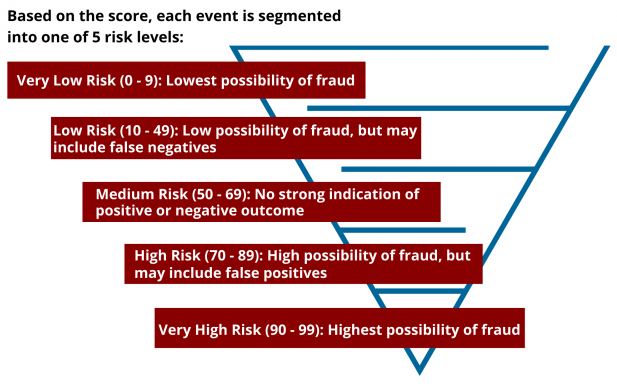

## 4 **Artificial Intelligence**

The e-shop will integrate AI in three primary areas: **personalized product recommendations**, **automated customer service (chatbots)**, and **fraud detection**.

- **Personalized Product Recommendations**: AI will analyze customer behavior (e.g., browsing patterns and purchase history) to dynamically suggest products tailored to each user’s preferences. This will increase customer satisfaction and boost conversion rates.

- **Automated Customer Service (Chatbots)**: A conversational AI chatbot will respond to customer inquiries, such as order status and shipping details, improving response times and customer satisfaction. The chatbot will use Natural Language Processing (NLP) to understand and assist customers more efficiently.

- [**Fraud Detection**](https://www.youtube.com/watch?v=QFyM3w95fXI): AI will monitor transaction patterns to detect anomalies, such as multiple purchases from different locations or unusual payment methods. The system will continually learn from new data, improving its ability to flag potential fraud.

  - **Behavioral analytics** is implemented using machine learning to distinguish **abnormal** from **normal** user behavior.

    1. Customers are segmented into groups, each with different behavioral attributes like time of purchases, cost of orders, number of orders, etc.

    2. The system identifies whether the user's behavior fits into one of these behavioral groups.

    3. The system calculates a **Fraud Score**, which represents the probability of fraud as a percentage.

       

    4. When the **Fraud Score is low**, the purchase is **approved**. Otherwise, the purchase is flagged as suspicious and must be verified by the customer or store.

  - **Fraud detection flow**:

    1. **Data warehousing**: Gather transaction data (like amounts, locations, and time).
    2. **Creation of association rules**: Understand what normal activity looks like.
    3. **If/Else analysing pattern**: Find transactions that don’t match usual patterns.
       - **Risk scoring**: Assign a score to flag risky transactions.
    4. **Customer authentication**: Investigate flagged transactions and stop fraud if confirmed.
    5. **Create alerts**: Create alerts for suspicious activities.
    6. **Learn and Improve (Data Warehousing)**: Use feedback to improve future fraud detection.

    

### **AI Learning Applications**

To ensure continuous improvement, AI will use several machine learning techniques:

- **Supervised Learning** for Product Recommendations: The system will learn from past customer interactions (purchases, searches) to recommend products more accurately over time.
- **Reinforcement Learning** for Personalization: AI will adapt product recommendations based on user actions (e.g., clicks or purchases), optimizing the customer experience through trial and error.
- **Unsupervised Learning** for Fraud Detection: AI will use anomaly detection to identify suspicious transactions, learning from new data to improve fraud detection over time.

### **System Implementation Considerations**

Successful AI integration requires addressing key considerations:

- **Data Privacy**: The system must ensure secure data collection and comply with regulations like GDPR, anonymizing personal information as needed.
- **System Compatibility**: AI models must integrate smoothly with the e-shop’s existing database, payment gateway, and admin systems.
- **Scalability**: As the system grows, AI models must handle increasing data and customer interactions efficiently.
- **User Feedback**: Ongoing customer feedback will help refine AI models, ensuring they improve based on real-world interactions.