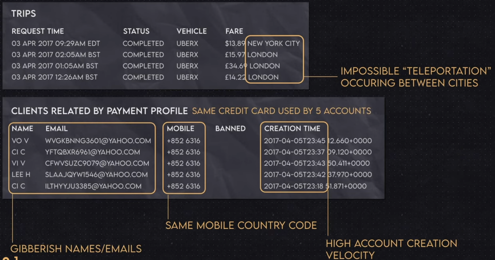
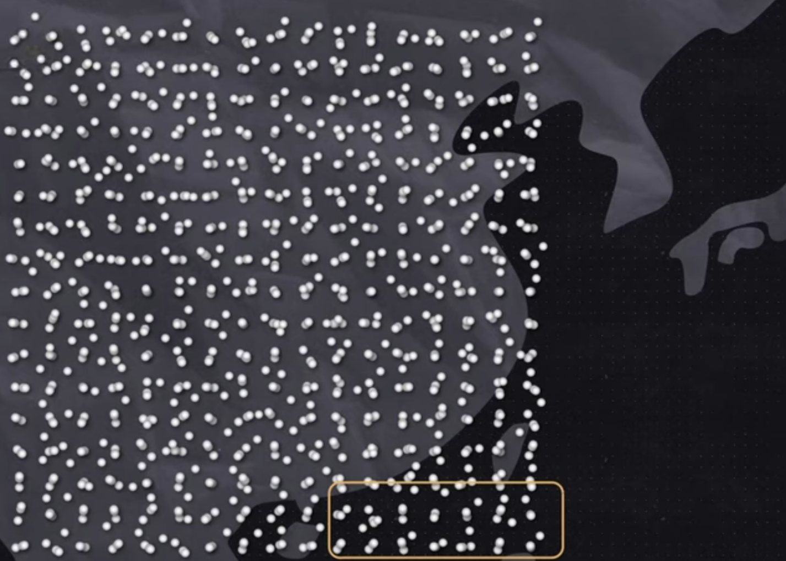

### Financial crimes explained on Uber usage

#### Client accounts and trip data

1. **Unusual Geolocation Patterns**:
   - "Teleportation" between distant cities (e.g., New York and London) within a short time frame is an indicator of fraudulent activity.
2. **Same Credit Card Used Across Multiple Accounts**:
   - Using the same credit card across several accounts in a short time span can signal misuse.
3. **Rapid Account Creation**:
   - A high frequency of account registrations within minutes is suspicious and may indicate automated generation of fake accounts.
4. **Gibberish Names and Emails**:
   - The use of randomly generated names and email addresses can suggest fraudulent accounts.
5. **Identical Mobile Codes**:
   - Using the same mobile number for multiple accounts is suspicious and may indicate account manipulation.



#### Pattern of Fraudulent Accounts



The dots symbolize the geolocation of users when the client accounts were created. We can see a pattern of a square, where some accounts were created in the ocean. This pattern may indicate fraudulent behavior.

#### Stop fraudsters using rules

Rule is simple **if** statement which compares specified attributes and when any of values does not succeed then it dispatch the payment in order to.

```pascal
if 
	"the account was created in China"
	and "the account is requesting for a ride in New York"
then
	"Dont't dispatch";
```

#### Never ending improvement of fraudsters

When fraudsters findout, they are blocked in China they can use VPN or proxy servers to redirect their requests from another locations. This is place where AI comes to find more advanced patterns in financial frauds to improve transaction safety.

